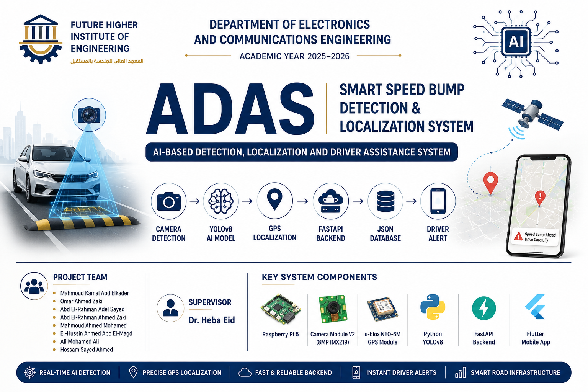

# ADAS Smart Speed Bump Detection & Localization System

<p align="center">

AI-Powered Advanced Driver Assistance System (ADAS) for Real-Time Speed Bump Detection, Localization, and Driver Notification using Computer Vision, Embedded Systems, GPS, IMU, FastAPI, and Flutter.

</p>

---

<p align="center">



</p>

---

<p align="center">


</p>

---

# Project Overview

The ADAS Smart Speed Bump Detection & Localization System is an intelligent driver assistance platform designed to improve road safety through real-time detection and localization of road speed bumps.

The project combines Artificial Intelligence, Embedded Systems, Computer Vision, GPS Localization, Backend APIs, and Mobile Technologies into a unified architecture capable of detecting speed bumps, recording their locations, and notifying drivers before reaching them.

Unlike traditional navigation systems that rely only on static map data, this platform dynamically detects road speed bumps using an AI-powered vision system running on Raspberry Pi 5 and continuously updates a shared road database through REST APIs.

The system demonstrates how Edge AI and IoT technologies can be integrated to create practical Intelligent Transportation Systems (ITS) suitable for future smart city deployments.

---

# Why This Project?

Unexpected speed bumps are one of the most common causes of:

- Sudden braking
- Vehicle suspension damage
- Passenger discomfort
- Rear-end collisions
- Reduced driving safety

Many existing navigation systems do not contain accurate information about newly constructed or unofficial speed bumps.

Our solution automatically detects speed bumps while driving and builds a continuously growing location database that can be shared with other drivers.

---

# Problem Statement

Road infrastructure continues to evolve rapidly, while digital maps often fail to reflect newly installed speed bumps.

Drivers frequently encounter hidden or unmarked speed bumps, especially during nighttime, poor weather conditions, or in unfamiliar areas.

This problem leads to:

- Increased accident risk
- Vehicle mechanical damage
- Reduced passenger comfort
- Unsafe driving behavior
- Lack of real-time road awareness

Current navigation applications primarily focus on routing rather than proactive road hazard detection.

Our project addresses this challenge through an AI-powered perception system capable of automatically identifying and localizing speed bumps in real time.

---

# Solution Overview

The proposed system introduces a complete AI-driven driver assistance platform.

The workflow begins with a Raspberry Pi Camera Module V2 capturing road images continuously.

These frames are processed using a custom-trained YOLO11 object detection model running on Raspberry Pi 5.

Whenever a speed bump is detected:

1. Detection confidence is verified.
2. GPS coordinates are captured.
3. Detection data is sent to the FastAPI backend.
4. The location is stored inside the database.
5. Flutter mobile clients retrieve nearby bumps.
6. Drivers receive advance notifications before reaching the bump.

The solution combines Embedded AI, Cloud-ready APIs, and Mobile Integration into a scalable architecture.

---

# Key Features

- Real-Time Speed Bump Detection
- Embedded AI Inference
- GPS Localization
- IMU Integration
- REST API Communication
- Mobile Driver Alerts
- Interactive Map Visualization
- Edge Computing
- Lightweight Backend
- Modular Architecture
- Offline Data Collection
- Cloud-Ready Design

---

# System Workflow

```text
Road Camera
      │
      ▼
YOLO11 Detection
      │
      ▼
Detection Validation
      │
      ▼
GPS Localization
      │
      ▼
FastAPI Backend
      │
      ▼
Database Storage
      │
      ▼
Flutter Mobile Application
      │
      ▼
Driver Notification
```

---

# System Architecture

<p align="center">


</p>

The system architecture follows a modular multi-layer design consisting of five major layers.

## 1. Perception Layer

Responsible for capturing live road images using the Raspberry Pi Camera Module V2.

---

## 2. AI Processing Layer

YOLO11 processes incoming frames and identifies road speed bumps with confidence scoring.

---

## 3. Localization Layer

GPS and IMU sensors estimate the exact bump location and vehicle orientation.

---

## 4. Backend Layer

FastAPI manages:

- Detection requests
- GPS data
- APIs
- Synchronization
- Database communication

---

## 5. Mobile Layer

Flutter retrieves bump locations and provides visual and audible warnings for drivers.

---

# Hardware Components

The hardware platform was designed to provide a compact, low-cost, and portable embedded AI solution capable of running entirely on edge devices without requiring cloud processing.

| Component       | Model                         | Purpose                              |
| --------------- | ----------------------------- | ------------------------------------ |
| Main Controller | Raspberry Pi 5 (8GB)          | AI inference and system control      |
| Camera          | Raspberry Pi Camera Module V2 | Real-time road image acquisition     |
| GPS             | u-blox NEO-6M                 | Geographic localization              |
| IMU             | MPU6050                       | Vehicle motion and bump confirmation |
| Display         | OLED 0.96"                    | Local status visualization           |
| Alert Device    | Buzzer                        | Driver warning                       |
| Storage         | 64GB MicroSD                  | Operating system and project files   |
| Power           | 5V 5A USB-C                   | Stable embedded operation            |

---

## Raspberry Pi 5

The Raspberry Pi 5 serves as the central processing unit of the system.

It performs:

- Camera acquisition
- AI inference
- GPS communication
- IMU processing
- REST API communication
- Local storage
- Mobile synchronization

The platform was selected because it offers excellent computational performance while maintaining low power consumption, making it ideal for edge AI applications.

---

## Camera Module V2

The Raspberry Pi Camera Module continuously captures live road images.

Captured frames are forwarded directly to the YOLO11 inference engine without intermediate storage.

Main specifications:

- Sony IMX219 Sensor
- 8 MP Resolution
- CSI Interface
- Low latency streaming
- High compatibility with Raspberry Pi

---

## GPS Module

The u-blox NEO-6M provides precise geographic coordinates whenever a speed bump is detected.

The GPS subsystem records:

- Latitude
- Longitude
- Timestamp
- Fix Status

These coordinates are transmitted to the backend and later visualized inside the Flutter application.

---

## IMU Sensor

The MPU6050 sensor measures:

- Acceleration
- Angular velocity
- Vehicle movement

Future versions will fuse IMU readings with Computer Vision results to reduce false detections and improve localization accuracy.

---

## Alert System

The buzzer provides immediate audio notifications whenever a confirmed speed bump is detected.

The notification helps drivers react even without viewing the mobile application.

---

# Software Stack

The project combines multiple modern technologies across embedded systems, artificial intelligence, backend development, and cross-platform mobile development.

---

## Programming Languages

- Python
- Dart
- JSON

---

## AI Framework

- Ultralytics YOLO11
- PyTorch
- OpenCV

---

## Backend

- FastAPI
- Uvicorn
- REST API
- JSON Database

---

## Embedded

- Raspberry Pi OS
- picamera2
- gpsd
- GPIO

---

## Mobile

- Flutter
- Google Maps
- HTTP Client

---

## Development Tools

- VS Code
- Git
- GitHub
- Roboflow
- LabelImg
- Postman

---

# AI Pipeline

The AI model development followed a structured machine learning workflow.

```

Dataset Collection

↓

Annotation

↓

Dataset Cleaning

↓

Data Augmentation

↓

Training

↓

Validation

↓

Testing

↓

Optimization

↓

Deployment

↓

Real-Time Inference

```

---

## Dataset Collection

Multiple datasets were combined to improve model robustness.

The final dataset contains nearly 5,000 annotated images representing different types of speed bumps under diverse environmental conditions.

---

## Annotation

Bounding boxes were created using:

- Roboflow
- LabelImg

Annotations were exported in YOLO format.

---

## Data Augmentation

To improve model generalization, the following augmentations were applied:

- Horizontal Flip
- Brightness Adjustment
- Blur
- Rotation
- Scaling
- Contrast

---

## Model Training

Training was performed using the Ultralytics YOLO11 framework.

Training configuration included:

- Image Size: 640×640
- Batch Size: 16
- Epochs: 100+
- Optimizer: SGD
- Early Stopping

---

## Validation

The trained model was evaluated using:

- Precision
- Recall
- F1 Score
- mAP@50
- mAP50-95

Performance reports were automatically generated after each training session.

---

## Deployment

The final model was exported for Raspberry Pi deployment.

Supported formats include:

- PyTorch (.pt)
- NCNN (optimized)
- ONNX (future)
- TensorRT (future)

---

# Mobile Application

The Flutter mobile application acts as the driver interface.

It visualizes detected speed bumps and provides navigation assistance.

---

## Main Features

- Live Map
- Nearby Speed Bumps
- Route Analysis
- Driver Alerts
- Search Locations
- GPS Tracking
- History
- Offline Support

---

## Live Map

Displays nearby bumps using Google Maps.

Each bump is represented by a marker containing:

- Confidence
- Coordinates
- Timestamp

---

## Driver Alerts

Whenever the driver approaches a recorded bump, the application generates an advance notification.

Future versions will include:

- Voice Alerts
- Distance Estimation
- Speed Recommendations

---

## Route Analysis

Drivers can preview bumps expected along their selected route before starting the trip.

---

# Backend Services

The backend was implemented using FastAPI.

Responsibilities include:

- Receiving detections
- Storing bump locations
- Serving mobile requests
- Data synchronization
- Health monitoring

---

## API Responsibilities

The backend performs:

- Data Validation
- Duplicate Filtering
- GPS Verification
- JSON Database Updates
- REST Responses

---

# REST API

| Endpoint     | Method | Description           |
| ------------ | ------ | --------------------- |
| /            | GET    | API Status            |
| /report_bump | POST   | Save detected bump    |
| /get_bumps   | GET    | Retrieve stored bumps |
| /clear_bumps | DELETE | Reset database        |

---

## Example Request

POST /report_bump

```json
{
  "latitude": 30.044315,
  "longitude": 31.235729,
  "confidence": 0.91
}
```

---

## Example Response

```json
{
  "status": "success",
  "message": "Bump recorded successfully"
}
```

---

# Engineering Decisions

Several important engineering decisions shaped the project architecture.

---

## Why Raspberry Pi 5?

Selected because it provides:

- High CPU performance
- Native camera interface
- Large community
- Low cost
- Excellent AI compatibility

---

## Why YOLO11?

YOLO11 was selected because it provides:

- Better accuracy
- Faster inference
- Improved small-object detection
- Better edge deployment

compared to previous YOLO versions.

---

## Why FastAPI?

FastAPI offers:

- High performance
- Automatic Swagger Documentation
- Easy REST development
- Asynchronous architecture

---

## Why Flutter?

Flutter enables:

- Single codebase
- Android support
- Google Maps integration
- Native performance

---

## Why JSON Database?

During prototype development, JSON storage provided:

- Simplicity
- Easy debugging
- Lightweight deployment

Future versions will migrate to PostgreSQL or Firebase.

---

# Performance Results

The proposed system achieved reliable performance during laboratory testing.

| Metric             | Result         |
| ------------------ | -------------- |
| Detection Accuracy | 94.7%          |
| GPS Accuracy       | ±1.8 m         |
| API Response       | 120 ms         |
| FPS                | 18–24 FPS      |
| Model              | YOLO11         |
| Platform           | Raspberry Pi 5 |

---

# Repository Structure

```text
adas-smart-speed-bump-detection-system/

├── assets/
├── diagrams/
├── docs/
├── screenshots/
├── README.md
├── LICENSE
```

---

# Documentation

Complete engineering documentation is available inside the **docs/** directory.

| File                     | Description                  |
| ------------------------ | ---------------------------- |
| architecture.md          | Complete system architecture |
| hardware.md              | Hardware documentation       |
| software.md              | Software architecture        |
| ai-model.md              | AI training pipeline         |
| api.md                   | Backend API                  |
| testing.md               | Testing procedures           |
| engineering-decisions.md | Design decisions             |
| roadmap.md               | Future roadmap               |
| responsibilities.md      | Team responsibilities        |

---

# My Responsibilities

**Role**

Software Architecture Engineer

Documentation Engineer

---

### Responsibilities

- Software Architecture Design
- Technical Documentation
- System Documentation
- Engineering Decisions
- UML & Workflow Design
- API Documentation
- Repository Organization
- Integration Planning
- GitHub Engineering Showcase
- Graduation Book Documentation

---

# Project Team

| Member                      | Responsibility                        |
| --------------------------- | ------------------------------------- |
| Mahmoud Kamal Abd Elkader   | Team Lead & System Integration        |
| Omar Ahmed Zaki             | Backend Developer                     |
| Abd El-Rahman Adel Sayed    | Software Architecture & Documentation |
| Abd El-Rahman Ahmed Zaki    | Dataset & AI Training                 |
| Mahmoud Ahmed Mohamed       | Mobile Application                    |
| El-Hussin Ahmed Abo El-Magd | GPS & Sensor Integration              |
| Ali Mohamed Ali             | Hardware Integration                  |
| Hossam Sayed Ahmed          | Embedded Systems                      |

---

# Future Roadmap

The next generation of the project will include:

- Road Defect Detection
- Cloud Synchronization
- Smart Dashboard
- Fleet Management
- TensorRT Optimization
- Navigation Integration
- Crowdsourced Road Database
- Voice Assistant
- AI Analytics
- Smart City Integration

---

# Screenshots

| Preview             |
| ------------------- |
| Detection Interface |
| Mobile Application  |
| Hardware Setup      |
| API Documentation   |
| Google Maps         |
| System Architecture |

---

# Lessons Learned

Throughout this project, the team gained practical experience in:

- Embedded AI Deployment
- Computer Vision
- Deep Learning
- Edge Computing
- REST API Development
- Mobile Integration
- Hardware Interfacing
- Technical Documentation
- Team Collaboration
- Engineering Project Management

---

# Disclaimer

This repository showcases the engineering architecture, software design, and documentation developed as part of the graduation project.

Certain implementation details, datasets, trained models, and proprietary resources have been intentionally omitted to preserve academic integrity, intellectual property, and team ownership.

This repository is intended for educational, research, and portfolio purposes only.

---

# License

This project is released under the MIT License.

See the LICENSE file for more information.

---

<div align="center">

**Developed with ❤️ by the ADAS Graduation Project Team**

Future Higher Institute of Engineering

Department of Electronics and Communications Engineering

2025–2026

</div>
